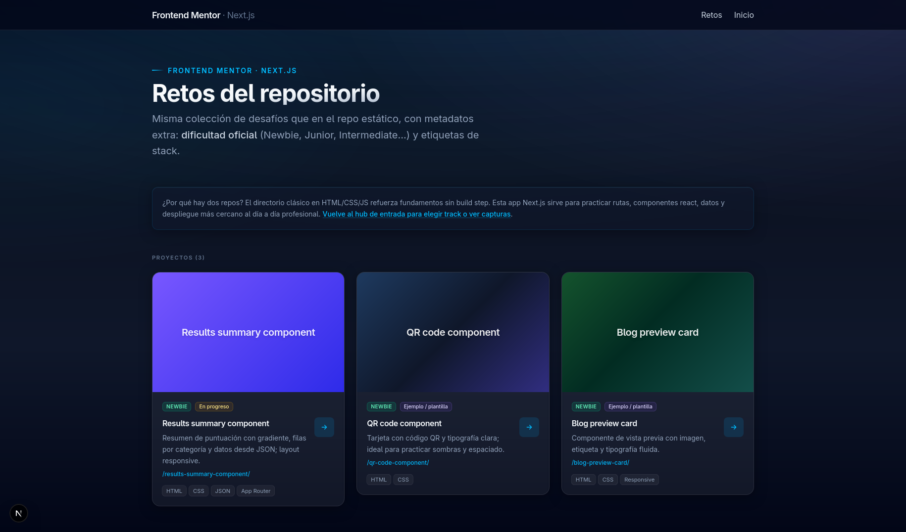

# Frontend Mentor · Next.js

[Spanish version](README.md)

Monorepo to practice multiple [Frontend Mentor](https://www.frontendmentor.io/) challenges with **Next.js** (App Router), keeping each challenge isolated (assets, code, and routes) so resources do not bleed across projects.



---

## Table of contents

- [Requirements](#requirements)
- [Getting started](#getting-started)
- [Repository layout](#repository-layout)
- [Adding a new challenge (playbook)](#adding-a-new-challenge-playbook)
- [Documentation](#documentation)
- [Contributing](#contributing)
- [Contact](#contact)

---

## Requirements

- Node.js compatible with Next.js 16
- Package manager: this repo uses **pnpm** (you can use `npm` or `yarn` with equivalent commands)

---

## Getting started

```bash
pnpm install
pnpm dev
```

Open [http://localhost:3000](http://localhost:3000) for the challenge index. The entry hub is at [`/start`](src/app/(with-layout)/start/page.tsx).

Other useful commands: `pnpm build`, `pnpm start`, `pnpm lint`, `pnpm format`.

---

## Repository layout

| Path | Purpose |
|------|---------|
| `src/app/` | App routes and layout (index at `/`, hub at `/start`) |
| `src/components/` | Shared components (header, cards, etc.) |
| `src/data/` | Index data (`challenges-card.ts`, etc.) |
| `src/features/{slug}/` | Per-challenge UI: components, `page.tsx`, **`readme.md`**, FM reference under **`docs/`** (`style-guide`, `design/`, `preview.jpg`), and **raster images and SVG** for the layout under **`images/`** (via `import`, not under `public/`) |
| `public/` | Global statics (e.g. `public/hub/`). Per challenge, only what needs a fixed public URL, e.g. **`public/{slug}/fonts/`**; do not put the layout’s image/icon set in `public/` (keep those in the feature folder) |
| `docs/IA/` | Playbook and `note.yaml` for assistant-driven challenge setup |
| `backups/` | **Local** archive of the original ZIP folder (see [playbook §7](docs/IA/FM-CHALLENGE-PLAYBOOK.md#7-git-y-la-carpeta-del-zip)); listed in `.gitignore` |
| `*/` at repo root | Only while integrating; move the ZIP folder to `backups/` when done |

---

## Adding a new challenge (playbook)

1. Unzip the challenge and place the folder at the **repository root** (often similar to `results-summary-component/`).
2. Read **[`docs/IA/FM-CHALLENGE-PLAYBOOK.md`](docs/IA/FM-CHALLENGE-PLAYBOOK.md)**: folder conventions, assistant checklist, and metadata rules.
3. Optional: fill the minimum in [`docs/IA/note.yaml`](docs/IA/note.yaml) **or** pass `folder_name` and `difficulty` in chat; the rest can be inferred from the ZIP README.
4. **After phase A** (or once everything needed is under `src/features/{folder_name}/` — **`readme.md`**, **`docs/`**, and **`images/`** for graphics — and under `public/{folder_name}/` **only** when needed e.g. for fonts with fixed URLs), **move the ZIP folder out of the root** to `backups/{folder_name}/` so the tree does not keep duplicates. See [playbook §7](docs/IA/FM-CHALLENGE-PLAYBOOK.md#7-git-y-la-carpeta-del-zip).

The playbook describes `src/features/{slug}/`, registration in `src/app/(layout-null)/[slug]/_utils/`, and updates to [`src/data/challenges-card.ts`](src/data/challenges-card.ts). **By default** the assistant only **organizes** (assets, data, stub, index); you implement the UI unless you explicitly ask for “phase B” (full implementation) per the playbook.

---

## Documentation

- Challenge integration: [`docs/IA/FM-CHALLENGE-PLAYBOOK.md`](docs/IA/FM-CHALLENGE-PLAYBOOK.md)
- Minimal per-challenge notes: [`docs/IA/note.yaml`](docs/IA/note.yaml)

---

## Contributing

1. Fork the repository
2. Create a branch (`git checkout -b feature/clear-name`)
3. Commit your changes (`git commit -m 'Short description'`)
4. Push the branch (`git push origin feature/clear-name`)
5. Open a Pull Request

---

## Contact

For suggestions or bug reports, open an issue on the GitHub repository.

---

**Development:** Fravelz
