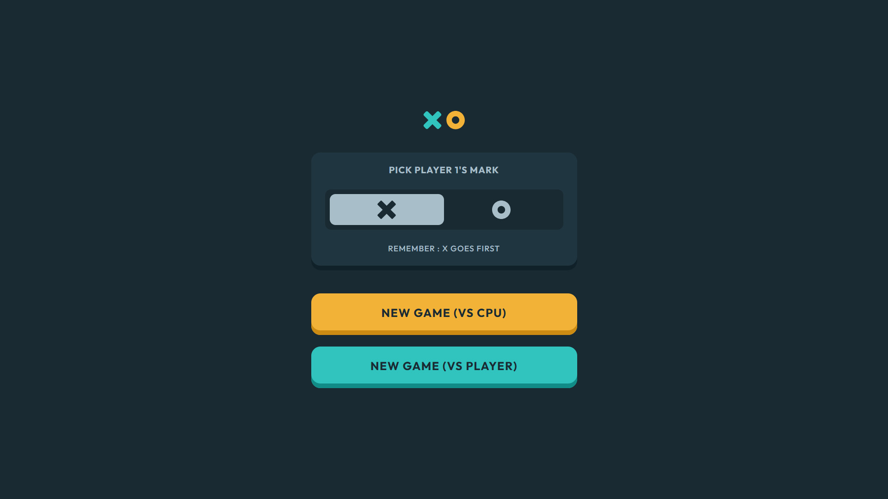

# Frontend Mentor — Tic Tac Toe Game

Reto [Tic Tac Toe](https://www.frontendmentor.io/challenges/tic-tac-toe-game-Re7ZF_E2v) integrado en esta app Next.js a partir del código de referencia en `tic-tac-toe-game/` (Vite + React).

## Funcionalidad

- Menú nueva partida: elegir marca del jugador 1 (X u O), modo **solo vs CPU** o **dos jugadores**.
- Tablero 3×3 con turnos, marcador (X / empates / O) y modal de fin de ronda o reinicio.
- CPU con movimiento aleatorio (misma lógica que el proyecto de referencia).
- Layout responsive (mobile / tablet) y sombras interiores tipo diseño FM.

## Vista previa de referencia

## En el monorepo

- Lógica y estado: [`context/game-context.tsx`](./context/game-context.tsx)
- Entrada de la ruta: [`page.tsx`](./page.tsx), raíz de UI: [`components/tic-tac-toe-app.tsx`](./components/tic-tac-toe-app.tsx)
- Enunciado FM: [`docs/challenge.md`](./docs/challenge.md)
- Tokens y colores: [`docs/style-guide.md`](./docs/style-guide.md)
- Captura para índice y OG (no es imagen de la UI empaquetada): [`public/tic-tac-toe-game/screenshot.png`](../../../public/tic-tac-toe-game/screenshot.png)
- Tarjeta del índice: [`src/data/challenges-card.ts`](../../data/challenges-card.ts)

## Notas

- Los **bonos** FM (persistencia en `localStorage`, IA minimax) **no** están implementados en la referencia por la que se portó; puedes añadirlos después en `game-context.tsx`.
